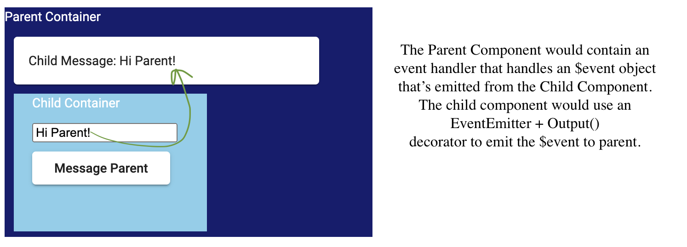

# Angular Component Communication

# Dependencies

The following libs were installed for this demo:

npm install --save @angular/material @angular/animations @angular/cdk
npm install --save angular/material2-builds angular/cdk-builds

# Background

There are 4 ways in which Angular can pass data between components

<b>1. Parent to Child:</b> Pass Data via @Input

<b>2. Child to Parent:</b> Pass data via @Output + EventEmitter from Child and Event Handler from the Parent. Event is emitted from the child, and the parent will handle it.

<b>3. Sibling to Sibling / Across App:</b> Pass Data via Services. Example includes RxJS Observables

<b>4. Pass Data from URL</b>: When transitioning between pages, you can use the URL to pass data to the next. URL data is passed by:
* A. Query Parameters: [queryParams] + activatedroute
* B. Router Parameters: Using [routerLink] + activatedroute

## 1. Parent to Child

## 2. Child to Parent

Sample: See ./component-communication/src/app/child-to-parent



The following outlines how a Child component can communicate with a Parent component

<b>A. Child Component</b>
- In the TypeScript file of the Child, utilize an Event Emitter + Output() decorator to store then transmit data to be handled by the Parent

```typescript
@Output() yourEmitter = new EventEmitter<string>();

messageData: string = '';

yourEmitterMethod(data: string) {
    this.yourEmitter.emit(data);
}
```

- Then, call the child emitter in the child's template file

```html
<button 
    (click)="yourEmitterMethod(messageData)">
    Message Parent
</button>
```

<b>B) Parent Component</b>
- In the Parent Component's TypeScript file, create a method that would be the Event Handler for the data emitted by the child component. This method should accept an $event object (sent by the child component)

```Typescript

  let value = '';

  yourEventHandler($event: any) {
    this.messageFromChild = $event;
  }
```

- Also in the Parent Component's Template file, you would apply your event handler into the Child's template call to retreive the $event:
```html
// from parent.component.html
<p> Parent Component</p>
<child-component 
    (messageToParentEvent)="messageEventHandler($event)">
</child-component>
```


